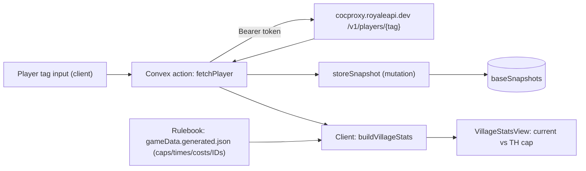

# Architecture

## Stack

- **Next.js (App Router) + React + TypeScript** — web app.
- **Convex** — backend. An `action` calls the CoC API server-side; a
  `mutation` stores snapshots; a `query` reads them.
- **Tailwind CSS** — styling.
- **Game rulebook data** — accurate max levels, upgrade times/costs, and
  entity IDs vendored from `coc.py`'s game-derived static data (`data/`),
  slimmed into `src/data/gameData.generated.json` by `scripts/build-game-data.mjs`.
- **Vercel** — hosting (later).

## Data flow (Phase 1)

## Why the proxy

The official CoC API (`api.clashofclans.com`) requires the request to come from
an **IP whitelisted on the token**. Serverless hosts don't have a stable IP, so
we route through the **RoyaleAPI proxy** (`cocproxy.royaleapi.dev`) and whitelist
its fixed IP (`45.79.218.79`) on the token instead. The token is stored as a
Convex environment variable (`COC_API_TOKEN`) and never reaches the client.

## Key files

- `convex/schema.ts` — `baseSnapshots` table.
- `convex/players.ts` — `fetchPlayer` (action), `storeSnapshot` (internal
  mutation), `latestSnapshot` (query), `normalizeTag`.
- `data/coc-static-data.json` — vendored rulebook (from coc.py). `data/README.md`
  documents source + how to refresh.
- `scripts/build-game-data.mjs` — slims the rulebook into `src/data/gameData.generated.json`.
- `src/lib/gameData.ts` — accessors over the generated data (`maxLevelAtTH`,
  `upgradeTime`, `upgradeCost`, `idToName`) and joins CoC API items into
  categories (`hero`, `pet`, `spell`, `troop`, `siege`).
- `src/components/VillageStats.tsx` — presentational stats view.
- `src/app/page.tsx` — tag input + orchestration.
- `src/app/ConvexClientProvider.tsx` — Convex React client provider.

## The "tracks" model (used from Phase 2 on)

Upgrades run in independent parallel tracks; time-to-max is the slowest track.

- **Builder track**: defenses, traps, resource/army buildings, heroes, Town Hall
  (N builders in parallel; walls are instant and ignored).
- **Laboratory track**: troops, spells, siege machines (one at a time).
- **Pets track**: Pet House (one at a time, TH14+).

The CoC player API exposes levels for troops/spells/heroes/pets/siege/equipment
but **not** individual buildings/defenses/traps — those will need manual entry or
an "assume maxed-for-TH except X" approach in a later phase.
